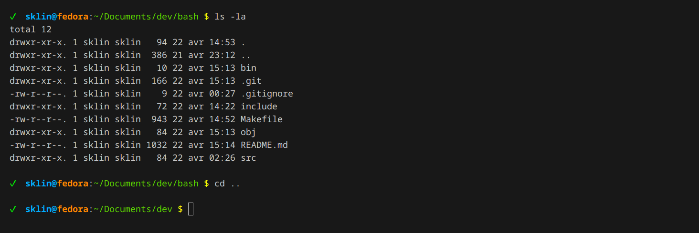

# 🐚 Minish — A Minimal Custom Unix Shell

Minish is a lightweight, custom-built Unix shell written in C. It supports essential shell functionalities including command parsing, execution, basic job control, prompt customization, and input editing with persistent command history via `readline`.

---

## ✨ Features

- ✅ **Customizable Prompt**
  Displays username, hostname, current working directory, and command status (✓ / ✗).

- 🔁 **Command Parsing**
  Handles arguments.

- 📜 **Command History**
  Uses GNU `readline` to support:

  - Arrow key navigation
  - Persistent history saved in `~/.myshell_history`
  - In-line editing

- ⚙️ **Basic Command Execution**
  Runs external programs and shell built-ins (like `cd` or `exit`).

- 🔒 **Root Detection**
  Shows `#` in the prompt if the user is root, `$` otherwise.

---

## 🛠️ Build & Run

### 🔧 Requirements

- GCC or Clang
- GNU Readline (`libreadline-dev` on Debian/Ubuntu)

### Build

```bash
make
```
> Make sure -lreadline is linked in the Makefile.

### ▶️ Run

```bash
./bin/minish
```

## Example Session



## 💡 Future Improvements
- [ ] Pipe (|) and Redirection (>, <)
- [ ] Background process support (&)
- [ ] Auto-completion with tab
- [ ] Environment variable expansion
- [ ] Aliases
- [ ] Parsing of quoted strings, escapes and more
